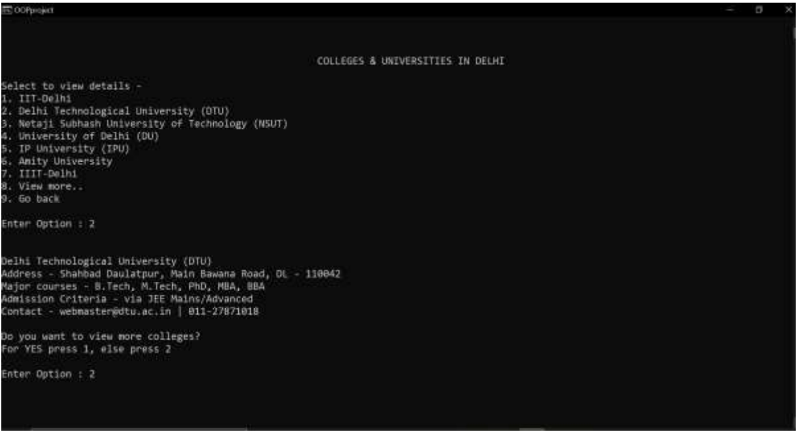

# SmartCityGuide
C++ based system developed to provide information regarding a particular city and reduce the need of a guide. Users can gather information regarding historical places, markets, institutes, and more.

